## :book: 𝙰𝚋𝚘𝚞𝚝 𝙼𝚎
- 🔐 𝚂𝚎𝚗𝚒𝚘𝚛 𝚂𝚎𝚌𝚞𝚛𝚒𝚝𝚢 𝙴𝚗𝚐𝚒𝚗𝚎𝚎𝚛 @ [ 𝙶𝚒𝚝𝙷𝚞𝚋](https://github.com/github) — 𝚙𝚛𝚘𝚝𝚎𝚌𝚝𝚒𝚗𝚐 𝚌𝚕𝚘𝚞𝚍 𝚒𝚗𝚏𝚛𝚊𝚜𝚝𝚛𝚞𝚌𝚝𝚞𝚛𝚎 𝚊𝚗𝚍 𝚎𝚗𝚊𝚋𝚕𝚒𝚗𝚐 𝚜𝚎𝚌𝚞𝚛𝚎 𝚍𝚎𝚟𝚎𝚕𝚘𝚙𝚖𝚎𝚗𝚝 𝚠𝚘𝚛𝚔𝚏𝚕𝚘𝚠𝚜
- ⚓ 𝚂𝚝𝚊𝚛𝚝𝚎𝚍 𝚖𝚢 𝚝𝚎𝚌𝚑 𝚌𝚊𝚛𝚎𝚎𝚛 𝚒𝚗 𝚝𝚑𝚎 𝚄𝚂𝙰𝙵; 𝚗𝚘𝚠 𝚊 𝙼𝚊𝚛𝚒𝚝𝚒𝚖𝚎 𝙲𝚢𝚋𝚎𝚛 𝚆𝚊𝚛𝚏𝚊𝚛𝚎 𝙾𝚏𝚏𝚒𝚌𝚎𝚛 𝚒𝚗 𝚝𝚑𝚎 𝙽𝚊𝚟𝚢 𝚁𝚎𝚜𝚎𝚛𝚟𝚎𝚜
- 🎓 𝙰𝚍𝚓𝚞𝚗𝚌𝚝 𝙸𝚗𝚜𝚝𝚛𝚞𝚌𝚝𝚘𝚛 𝚊𝚝 𝚝𝚑𝚎 𝚄𝚗𝚒𝚟𝚎𝚛𝚜𝚒𝚝𝚢 𝚘𝚏 𝙳𝚎𝚗𝚟𝚎𝚛, 𝚜𝚑𝚊𝚙𝚒𝚗𝚐 𝚏𝚞𝚝𝚞𝚛𝚎 𝚜𝚎𝚌𝚞𝚛𝚒𝚝𝚢 𝚙𝚛𝚘𝚏𝚎𝚜𝚜𝚒𝚘𝚗𝚊𝚕𝚜
- ⛰️ 𝙱𝚊𝚜𝚎𝚍 𝚒𝚗 𝙲𝚘𝚕𝚘𝚛𝚊𝚍𝚘

## 🛠 𝙾𝚙𝚎𝚗 𝚂𝚘𝚞𝚛𝚌𝚎 𝙸 𝚃𝚒𝚗𝚔𝚎𝚛 𝙾𝚗
- 🚩 [𝚂𝚎𝚗𝚝𝚒𝚗𝚎𝚕𝙵𝚘𝚛𝚐𝚎𝙲𝚃𝙵](https://github.com/chadeckles/sentinelforgectf) — 𝚊 𝚏𝚘𝚛𝚎𝚟𝚎𝚛-𝚏𝚛𝚎𝚎, 𝚘𝚙𝚎𝚗-𝚜𝚘𝚞𝚛𝚌𝚎 𝙲𝚃𝙵 𝚙𝚕𝚊𝚝𝚏𝚘𝚛𝚖 𝚏𝚘𝚛 𝚋𝚞𝚒𝚕𝚍𝚎𝚛𝚜, 𝚑𝚊𝚌𝚔𝚎𝚛𝚜, 𝚊𝚗𝚍 𝚕𝚎𝚊𝚛𝚗𝚎𝚛𝚜
- 🦮 [𝙻𝚎𝚊𝚜𝚑](https://github.com/chadeckles/leash) — 𝚔𝚎𝚎𝚙 𝚢𝚘𝚞𝚛 𝙰𝙸 𝚊𝚐𝚎𝚗𝚝𝚜 𝚘𝚗 𝚊 𝚕𝚎𝚊𝚜𝚑: 𝚊 𝚍𝚎𝚗𝚢-𝚋𝚢-𝚍𝚎𝚏𝚊𝚞𝚕𝚝 𝚙𝚘𝚕𝚒𝚌𝚢 𝚎𝚗𝚐𝚒𝚗𝚎 𝚠𝚒𝚝𝚑 𝚈𝙰𝙼𝙻 𝚛𝚞𝚕𝚎𝚜 𝚊𝚗𝚍 𝚝𝚊𝚖𝚙𝚎𝚛-𝚎𝚟𝚒𝚍𝚎𝚗𝚝 𝚊𝚞𝚍𝚒𝚝 𝚕𝚘𝚐𝚜

## 🌟 𝙾𝚏𝚏 𝚝𝚑𝚎 𝙺𝚎𝚢𝚋𝚘𝚊𝚛𝚍
- 👪 𝚂𝚙𝚎𝚗𝚍𝚒𝚗𝚐 𝚝𝚒𝚖𝚎 𝚠𝚒𝚝𝚑 𝚏𝚊𝚖𝚒𝚕𝚢 𝚊𝚗𝚍 𝚏𝚛𝚒𝚎𝚗𝚍𝚜
- ⛳ 𝙷𝚊𝚟𝚒𝚗𝚐 𝚏𝚞𝚗 𝚘𝚗 𝚝𝚑𝚎 𝚐𝚘𝚕𝚏 𝚌𝚘𝚞𝚛𝚜𝚎
- 🏂 𝚂𝚗𝚘𝚠𝚋𝚘𝚊𝚛𝚍𝚒𝚗𝚐 𝚒𝚗 𝚝𝚑𝚎 𝚁𝚘𝚌𝚔𝚢 𝙼𝚘𝚞𝚗𝚝𝚊𝚒𝚗𝚜
- 🏋️ 𝙴𝚡𝚎𝚛𝚌𝚒𝚜𝚒𝚗𝚐 𝚒𝚗 𝚝𝚑𝚎 𝚐𝚢𝚖
- 🥾 𝙲𝚊𝚖𝚙𝚒𝚗𝚐, 𝚑𝚒𝚔𝚒𝚗𝚐, 𝚊𝚗𝚍 𝚙𝚊𝚍𝚍𝚕𝚎𝚋𝚘𝚊𝚛𝚍𝚒𝚗𝚐

## 📫 𝙷𝚘𝚠 𝚝𝚘 𝚛𝚎𝚊𝚌𝚑 𝚖𝚎

